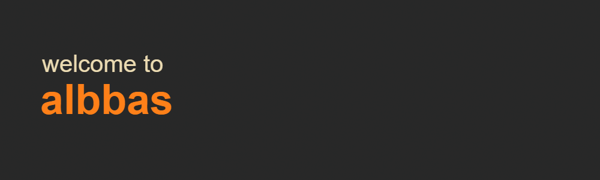

<p align="center">
  
</p>

<p align="center">
  <a href="https://albbas.mateakos.com"></a>
  <a href="https://codescene.io/projects/83217"></a>
</p>

~ private file hosting on your own domain.

upload a file, get a short unguessable link. files are served directly and stay
private - that simple.

## features

- drag-and-drop uploads that return a short, unguessable link on your own domain
- per-user subdomain share links, e.g. `file.yourdomain.com`
- direct file serving; files are deleted whenever you say so
- paginated gallery with previews
- downloadable sharex (`.sxcu`) configs
- no tracking, no accounts for visitors, nothing public
- S3-compatible storage (e.g. Supabase) or local disk
- upload size limits and per-hour rate limiting

---

## getting started

### prerequisites

- Node.js 22+
- pnpm 10
- Docker (for the compose deployment)

### local development

```bash
pnpm install
pnpm dev
```

the api runs on `:3001`, the web app on `:5173`.

### docker deployment

```bash
cp .env.example .env
# fill in your secrets, then
docker compose up --build
```

this brings up PostgreSQL, Redis, the api, the web app, and Caddy. the api seeds
an initial admin account on first boot.

## configuration

the main knobs live in `.env` (see `.env.example`):

| variable                         | purpose                                |
| -------------------------------- | -------------------------------------- |
| `ORIGIN`                         | public origin for the web app (SSR)    |
| `SESSION_SECRET`                 | signs session cookies (32+ chars)      |
| `ENCRYPTION_KEY`                 | encrypts api keys at rest (32+ chars)  |
| `STORAGE_BACKEND`                | `s3` or `local`                        |
| `S3_*`                           | S3-compatible endpoint, keys, bucket   |
| `MAX_UPLOAD_BYTES`               | max upload size                        |
| `UPLOAD_RATE_LIMIT_PER_HOUR`     | uploads allowed per user per hour      |
| `ADMIN_EMAIL` / `ADMIN_PASSWORD` | seeded admin account (first boot only) |

## project structure

```
apps/
  api/       fastify + tRPC server, prisma schema, s3 + local storage
  web/       sveltekit frontend
packages/
  shared/    shared types and constants
deploy/      deployment helpers
Caddyfile    reverse proxy config
docker-compose.yml
```

## scripts

| command          | what it does               |
| ---------------- | -------------------------- |
| `pnpm dev`       | run everything in dev mode |
| `pnpm build`     | build all packages         |
| `pnpm lint`      | lint all packages          |
| `pnpm typecheck` | typecheck all packages     |
| `pnpm test`      | run tests                  |
| `pnpm format`    | format with Prettier       |

## license

[GPLv3](LICENSE)
